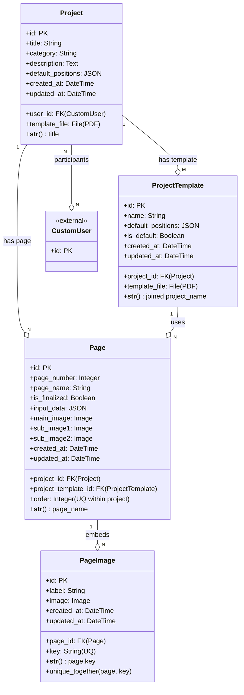

# PPM Domain ER Diagram - DrawIO Flavor
**Title: PPM_Core_Schema**
drawio:diagram
drawio:version:16.2.5


```
Note: DrawIO Flavor用PPM ERD
- BOX型: Class Model
- DIAMOND: Relationship
- CROWS FOOT: Cardinality (1:N, N:M)
```
